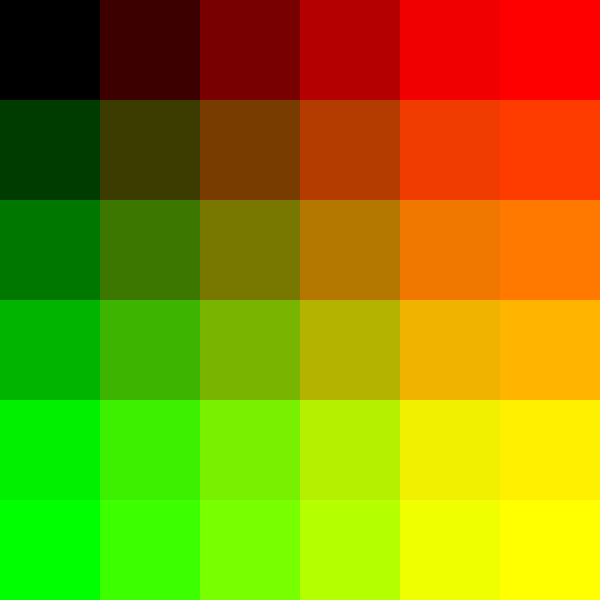
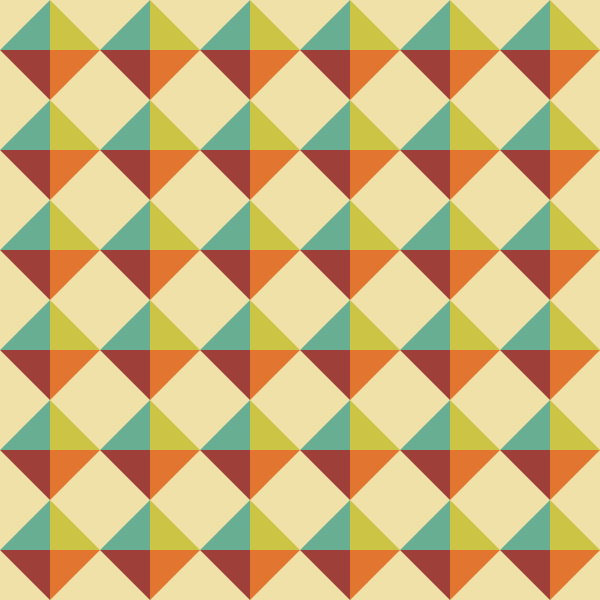

# 2020年度コンピュータグラフィックス試験問題

# 試験問題1
以下の画像のような2次元の静止画を作成してください．  
キャンバスサイズは600x600です．  
枠線は描画しないです．  
100 x 100サイズの四角形を6 x 6描画します．  
塗りつぶしの色はx軸方向に赤色が60ずつ増えます．  
同様にy軸方向に緑色が60ずつ増えます．  
青色は0のままです．  

## 実行例

# 試験問題2
以下の画像のような2次元の静止画を作成してください．  
キャンバスサイズは600x600です．  
背景色は(240, 225, 169)  
四角形の左上の色は（104, 174, 146)  
四角形の右上の色は（204, 196, 69)  
四角形の右下の色は（226, 117, 47)  
四角形の左下の色は（158, 64, 57)  

## 実行例

# 試験問題3
以下の画像のような2次元のアニメーションとイベント処理のプログラムを作成してください．  
キャンバスサイズは600x600です．  
背景色は「白」です．  
枠線は描画しません．　
初期の塗りつぶしは「黒」です．  
直径50の円をキャンバスの中心に表示してください．  
方向キーが入力されたらその方向に5ずつ移動してください．  
キー入力で「r」もしくは「R」が入力されたら円を「赤」で塗りつぶしください．  
キー入力で「g」もしくは「G」が入力されたら円を「緑」で塗りつぶしください．  
キー入力で「b」もしくは「B」が入力されたら円を「青」で塗りつぶしください．  

## 実行例
(アニメーションはYouTubeにアップしてある）  
  

# 試験問題4
以下の画像のような2次元のアニメーションとイベント処理のプログラムを作成してください．  
キャンバスサイズは600x600です．  
背景色は「黒」です．  
枠線は描画しません．  
初期の塗りつぶしは「白」です．  
マウスをクリックするたびにキャンバスの中心から白く塗りつぶされた円をを生成する  
その円は中心からランダムな方向に2ずつ放射線状に移動する  
さらに，その円は1フレームごとに透明度が2ずつ減っていき，最終的には透明度0となり消える．  
## 実行例
（アニメーションはYouTubeにアップしてある）  
  

# 試験問題5
以下の画像のような2次元のアニメーションとイベント処理のプログラムを作成してください．  
第12回の授業で作成したプログラムを元にしてください．  
自力でもかまいません．  
キャンバスサイズは800x600です．  
背景色は「黒」です．  
枠線は描画しません．  
初期の塗りつぶしは「白」です．  
実行するとキャンバスの中心からランダムな方向に円が移動して壁の当たると反射します．  
マウスが押された瞬間にすべての円がマウスの位置から再度ランダムな方向に移動を始める．  
重力や摩擦は無視します．  

## 実行例
（アニメーションはYouTubeにアップしてある）  
  

# 試験問題6
下記条件のもとで自由に作品を作成してください．  
キャンバスサイズは800x600  
アニメーションであること  
インタクションをいれる  
クラスを使うこと  
過去に提出したものは提出できません．  

<!--
markdownにYouTubeのサムネイル画像付きのリンクについての参考サイト
https://gist.github.com/billthelizard/a632b6a6a79839cba1c0fd67f64b87ff
自動でコードを生成するサイト
http://embedyoutube.org/
-->